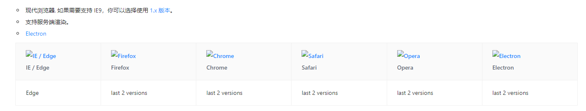

# 项目说明

## 项目名称

> 家庭医生管理端

## 项目搭建

### node版本

**node 16.13.2**

### 1、由vue3+vite构建，尝试使用ts语言开发；

### 2、后台ant design vue2的组件

a、安装 antd design vue2

```vue
  npm install ant-design-vue@next --save
```

b、安装插件 unplugin-vue-components（来源于antd vue 3）
```vite.config.js 按需加载

import Components from 'unplugin-vue-components/vite'
import { AntDesignVueResolver } from 'unplugin-vue-components/resolvers'

export default {
  plugins: [
    /* ... */
    Components({
      resolvers: [
        AntDesignVueResolver(),
      ],
    }),
  ],
};
```
c、自定义样式

```vite.config.js
     css: {
        preprocessorOptions: {
          less: {
            modifyVars: resetAntdStyleVarsInfo, // resetAntdStyleVarsInfo import的自定义属性对象
            javascriptEnabled: true,
          },
        },
  },
```
d、浏览器支持情况：



### 3、配合ant design vue2，使用less样式语言
```
   安装 npm install less less-loader --save--dev
```

### 4、使用eslint和prettier管理代码规范
```eslint
    1、npm install eslint --save-dev
    2、npm init @eslint/config
    3、npm install --save-dev eslint-plugin-prettier
    4、npm install --save-dev --save-exact prettier
```

### 5、vue router路由和vuex状态管理
```vue
    npm install vuex@next --save
    npm install vue-router@4**
```

### 6、浏览器兼容性提醒@vitejs/plugin-legacy

a、安装@vitejs/plugin-legacy

```browser
    npm install @vitejs/plugin-legacy --save-dev
```

b、配置vite
```vite.config.js
    plugins: [
    legacy({
      targets: ['ie >= 11'],
      additionalLegacyPolyfills: ['regenerator-runtime/runtime']
    })
  ]
```
### 7、axios 数据请求
```npm
    npm install axios --save
```

## 问题及版本迭代
